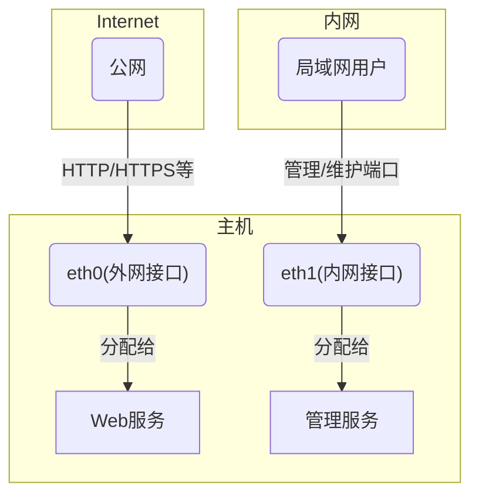

# firewalld概述

防火墙无疑是使用计算机操作系统时绕不开的话题，无论你使用的是什么操作系统。

你第一次接触防火墙是什么时候？这里有感而猜，作者本人第一次接触恐怕是在电影里，哈哈~

日常使用中，我们经常会因为防火墙的问题导致服务无法访问。之前我对防火墙抱有很高的崇拜心理，因为那时候感觉这是电影里黑客才会接触的东西。

当然，这篇文章远没有涉及到电影中的情节，本文依然是小白视角，真正晦涩的内容也不会涉及。

firewalld本身也是一个前端工具，其诞生的目的是简化防火墙规则的编写。因此，有了firewalld之后，用户层面使用防火墙的上手难度已经大大降低。

而在firewalld背后真正起作用的是netfilter——第四代系统内核防火墙。


## 前言

**本文对读者有以下假设**
- 熟悉操作系统的使用
- 熟悉网络程序的运行机制
- 了解网络工作原理

**软件环境说明**
> 本文仅针对装有firewalld的Linux系统发行版

## 防火墙是什么

防火墙在不同场景下有不同的定义。笼统地说，防火墙是处于信任网络和不可信网络之间的一道安全屏障。

防火墙因网络而诞生。一开始，网络的作用是让各个计算机之间单纯地共享信息，但随着共享网络的扩大，这些由网络连接起来的主机之间，出现了以破坏信息真实性为目的的行为。例如，向某个无辜主机发送大量数据请求，这个主机会因此准备大量计算资源来应对这波信息潮，导致其在处理正常信息数据时应接不暇，这就是对正常通信的破坏。

为了保障主机在网络间的正常通信，一种专门处理信息洪流的网络设备应运而生，它用于协调网络信息流的稳定传输。这类设备早期被称为网关，而现在意义上的网关，更多指的是应用网关。

<figure>
  
  <figcaption style="text-align:center;">防火墙示意图</figcaption>
</figure>

随着技术的升级迭代，为了提高网络传输能力，一个主机可以接受来自多个不同路由器的网络数据，也就是说主机具备[多个网络接口](https://info.support.huawei.com/computing/server3D/res/server/taishan1280/index.html?lang=cn)。
<figure>
  
  <figcaption style="text-align:center;">华为服务器——具备多个网络接口的服务器示例</figcaption>
</figure>

如果不注意，你可能会把这种具备多个网络接口的主机当成路由器。这里值得一提的是，路由器也是计算机操作系统，只不过它被设计为专门处理网络数据，在软件层和硬件上与通用计算机有所区别。

本文以操作系统内核与网络接口之间为场景/上下文。具体来说，计算机接收到的网络数据要经过多层处理，而到达计算机的第一个处理层就是防火墙，它会判断来自网络的信息是否可以继续进入系统做进一步处理。

这里，计算机内部可视为一个可信网络，而从路由器到计算机之前的部分都属于不可信任的网络。


## 为什么叫防火墙

正如前面介绍的，计算机可能会受到突然的信息潮攻击，就像面临洪水猛兽或突发大火一样，需要一堵墙来阻挡灾难，防火墙这个名字正是用来形容这种抵御信息潮流攻击或灾害的功能。


## 防火墙历史

| 阶段   | 核心组件      | 活跃年份（约） | 主要内核版本  | 关键特性                                                     |
| ------ | ------------- | -------------- | ------------- | ------------------------------------------------------------ |
| 第一代 | ipfwadm       | 1994-1998      | 1.1/2.0       | 基础包过滤，移植自BSD，操作直接但扩展性差。                  |
| 第二代 | ipchains      | 1998-2001      | 2.2           | 引入“链（Chains）”结构，支持更复杂的规则逻辑。               |
| 第三代 | iptables      | 2001-2014      | 2.4/2.6/3.x   | 里程碑：引入Netfilter框架与状态检测（Connection Tracking）。 |
| 第四代 | nftables      | 2014-2023      | 3.13/4.x/5.x  | 内核虚拟机架构，显著提升规则查找效率，统一协议管理。         |
| 第五代 | eBPF/bpfilter | 2020-2026+     | 5.0/6.x及以上 | 现状：极致的硬件加速与动态编程，支持AI驱动的自动化防御。     |


## firewalld

本文要介绍的是基于netfilter的firewalld。

> Firewalld是一款简单易用、有状态、基于区域的防火墙。它使用策略和区域来组织防火墙规则，网络在逻辑上被划分为多个区域，区域间的流量可以通过策略进行管理。

firewalld的简单易用是有代价的，它不能提供netfilter的全部功能，仅能提供基于端口和传输层协议层面的网络控制能力。相应地，RedHat家族之外的Ubuntu也提供了ufw这样的防火墙工具，同样是基于网络端口和传输层协议实现网络流量审查。


## firewalld关键概念

### 接口

接口通常指系统识别出的网络接口，也就是现实意义上的网线插孔。

实际上，除了物理意义上的网线插孔，还可以创建由内核提供的逻辑接口（虚拟接口）。虚拟接口可以模拟路由表，发往虚拟接口的地址最终都会通过虚拟路由表导向物理网络接口。

一般来说，一个接口绑定一个IP。同样，RedHat生态下还提供NetworkManager来管理接口。

### 端口/网络程序/服务

在计算机上运行的、需要与网络进行信息交换的程序都统称为网络程序。即便是某些主要以本地运行为主的“单机游戏”进程，也可能通过联网同步游戏进度，因此也可以称之为网络程序（即使它由一系列子线程组成）。有些程序以等待网络数据为主，有些则以发送数据为主。

而以等待网络数据为主的程序，可称为网络服务，也就是程序意义上的服务器。这些网络程序通常会占用计算机的某个逻辑端口（由系统/软件实现）。

这些网络服务会等待来自网络I/O模型的第4层协议（传输层）将数据发送到这个软件层面的逻辑端口，从而实现网络信息交换。

这里值得一提的是，有些网络程序/服务可能会同时开放多个端口等待网络连接。

### 网络区域/信任级别

区域的主要目的是将一部分网络程序/服务组成一个逻辑组，然后将这个逻辑组与实际网络接口绑定。通常一个区域能绑定多个接口，但一个接口只能与一个区域绑定。

如前文所述，网络程序/服务通常占用一个或多个端口。本质上，firewalld的设计目的是将一些数字形式的逻辑端口抽象成网络/程序服务标签，这样就不需要记住某个服务具体在哪个端口，记住标签就相当于记住了其运行的端口。例如，我们可以从标签为ftp的服务中永久删除ftp所需的20号端口：

```bash
firewall-cmd --permanent --service=ftp --remove-port=20/tcp
```

再为ftp添加所需的20-21端口：

```bash
firewall-cmd --permanent --service=ftp --add-port=20-21/tcp
```

以上逻辑组合的主要优势在于，假设某个网络接口用于对外提供网页服务，另一个接口专门用于私有/局域网内部管理，那么该主机就应该存在两个网络区域。



如上所示，eth0作为外网线缆接口被分配到“public”或“dmz”区域，用于向公网提供web服务；eth1作为内网线缆接口被分配到“internal”或“trusted”区域，仅允许局域网内的用户通过管理端口访问管理服务，以此实现不同网络区域的隔离与安全策略。

光这么说可能难以直观感受其中的区别，我举个例子：

在public区域只分配443（https）端口，这样通过eth0的请求就能正常进入，并在处理后返回正常网页。作为网站所有者，可以通过内部网络的22号端口随意更改网页内容，这是主机所有者的安排。

假设有个不怀好意的人，想通过eth0（也就是提供网页服务的网络）尝试访问管理端口，以此篡改eth0所提供的网络内容。

也就是说，他想通过eth0篡改网页内容，但由于eth0所在的区域是public，该区域并未开放22端口的访问，所以来自eth0的网络请求（信息数据）会被防火墙拒绝，这就体现了防火墙的安全机制。

### 策略/规则

所谓策略，指的是两个区域之间的流量如何相互跳转。此部分暂不展开。

### 临时和永久规则状态

firewalld通过区域和策略实现对流量的处理（拒绝/丢弃/转发/继续处理），它还提供了一种临时状态，用于测试某些区域/策略是否能正常运转。临时状态的规则和策略能及时生效，但区别在于，临时的区域和策略在防火墙重启后将不再有效，取而代之的是永久配置。如果要将临时状态保留为永久配置，需要显式地将其保存至永久配置：

```bash
$ sudo firewall-cmd --runtime-to-permanent
```
