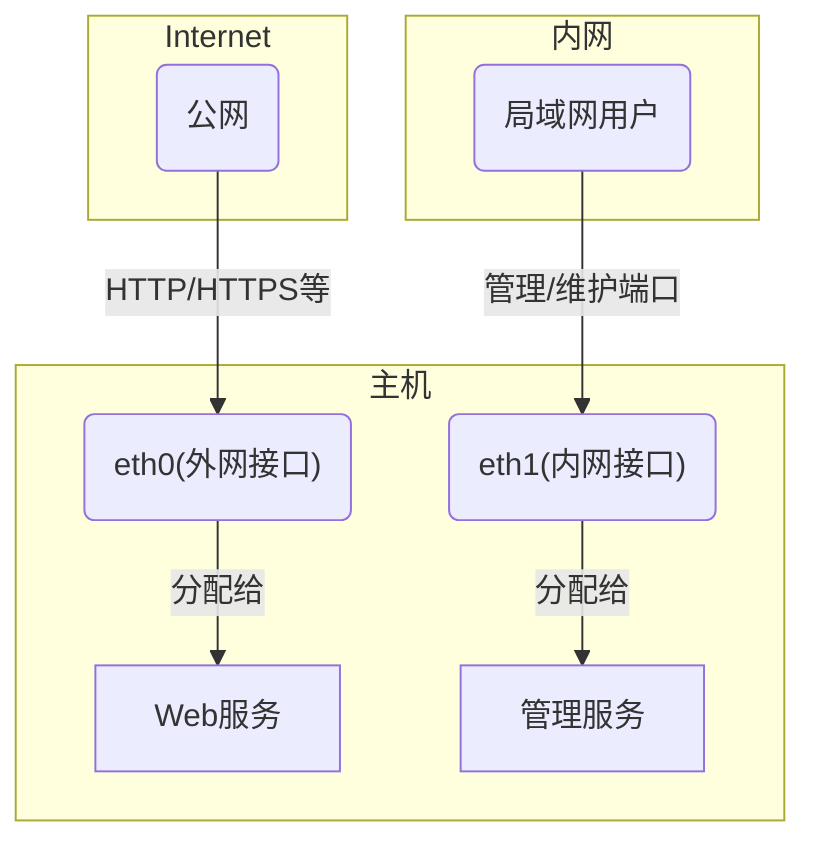

# firewalld概述


防火墙一定是使用计算机操作系统绕不开的一个话题. 无论你使用的是什么操作系统

你第一次接触防火墙是什么时候? 这里随便有感而猜, 作者本人第一次接触怕是在电影中 :) 笑~

日常使用时, 经常会因为防火墙的问题导致服务无法访问, 之前对防火墙抱有很高的崇拜心理, 因为那时电影中黑客才会接触的东西.

当然这片文章也远远没有涉及到电影中的情节, 本人依然是小白文, 真正晦涩本文也不曾涉及.


firewalld本身也是一个前端工具, 为了简化防火墙的编写规则而出现的. 因此, 到firewalld这, 已经很大程度上减轻了用户层面对防火墙的使用上手难度


firewalld的背后真正起作用的是netfilter(第四代系统内核防火墙).


## 前言

**本文有以下对读者的假设**

- 熟悉使用操作系统
- 熟悉网络程序运行
- 了解网络工作原理

**软件环境说明**

> 本文仅针对装有frewalld的linux系统发行版

## **防火墙是什么**

防火墙在不同场景下有不同的定义. 笼统的说, 防火墙就是一个处于信任网络和不可信网络之间的安全屏障.


防火墙因网络诞生. 一开始, 网络用于各个计算机之间单纯共享信息而存在, 但是随着共享网络的扩大, 这些由网络连接起来的主机之前, 诞生了以破坏信息真实性为目的的例子. 例如向某个无辜主机发送即将迎来大量数据的请求, 这个无辜的主机会因此准备大量的计算资源用于迎接这波信息潮, 导致机器处理正常的信息数据时, 忙不过来了. 此为破坏正常通信. 

为了保障主机在网络间正常通信, 诞生了一个专门处理信息洪流的网络设备, 用于协调网络信息流的稳定传输, 此类设备早期称为网关, 现在意义上的网关, 更多的指的是应用网关. 


<figure>
  
  <figcaption style="text-align:center;">防火墙示意图</figcaption>
</figure>


随着技术的升级迭代,或为了提高网络传输能力, 一个主机可以接受来自多个不同路由器的网络数据, 即主机具备[多个网络接口](https://info.support.huawei.com/computing/server3D/res/server/taishan1280/index.html?lang=cn). 
<figure>
  
  <figcaption style="text-align:center;">华为服务器 - 具备多个网络接口的服务器示例</figcaption>
</figure>


如果你不注意, 可能会被这样具备多个网络哦接口的主机当成一个路由器. 这里值得一提, 路由器也是计算机操作系统, 只不过其被设计为专门处理网络数据罢了.在软件层和硬件上与通用计算机有所区别.


本文以操作系统内核与网络接口之间为一个场景/上下文. 具体来说, 一个计算机接收到网络接口要经过多层处理, 到达计算机第一个处理层就是防火墙. 他判断来自网络的信息是否可以继续进入系统做进一步处理.


此处, 计算机内部就算是一个可信网络, 而路由器到计算机之前都算不可信任的网络. 


## **为什么叫防火墙**

正如防火墙介绍中, 计算机可能受到突然的信息潮, 但是如同洪水猛兽, 或突然的大火烧, 需要一个墙壁挡住灾难一样, 防火墙就用来形容此类信息潮流的攻击或者灾害.


## **防火墙历史**

| 阶段   | 核心组件        | 活跃年份（约） | 主要内核版本     | 关键特性                                                       |
| ------ | --------------- | -------------- | ---------------- | -------------------------------------------------------------- |
| 第一代 | ipfwadm         | 1994 - 1998    | 1.1 / 2.0        | 基础包过滤，移植自 BSD，操作直接但扩展性差。                   |
| 第二代 | ipchains        | 1998 - 2001    | 2.2              | 引入“链（Chains）”结构，支持更复杂的规则逻辑。                 |
| 第三代 | iptables        | 2001 - 2014    | 2.4 / 2.6 / 3.x  | 里程碑：引入 Netfilter 框架与状态检测（Connection Tracking）。 |
| 第四代 | nftables        | 2014 - 2023    | 3.13 / 4.x / 5.x | 内核虚拟机架构，显著提升规则查找效率，统一协议管理。           |
| 第五代 | eBPF / bpfilter | 2020 - 2026+   | 5.0 / 6.x 及以上 | 现状：极致的硬件加速与动态编程，支持 AI 驱动的自动化防御。     |


## firewalld

本文要介绍的是基于netfilter的firewalld. 


> Firewalld 是一款简单易用的、有状态的、基于区域的防火墙。它使用策略和区域来组织防火墙规则。网络在逻辑上被划分为多个区域，区域间的流量可以通过策略进行管理。

firewalld的简单易用是有代价的.  firewalld 不能提供 netfilter 的全能力, 仅提供基于端口和传输层协议层面网络控制能力. 相对应的, redhat家族之外的ubuntu也提供了ufw这样的防火墙工具,同样是基于网络端口和传输层协议实现的网络流量审查

## firewalld 关键概念

### **接口**

接口通常表示为系统内的识别出来的网络接口,即现实意义上的网线插孔.

实际上, 除了物理意义上的网线插孔, 还可以创建由内核提供逻辑接口(虚拟接口). 虚拟接口可以模拟路由表, 发往虚拟接口的地址其实最后都通过虚拟路由表导向了物理网络接口.

一般来说, 一个接口绑定一个ip. 同样, redhat生态下还同时提供NetworkManager来管理接口

### **端口/网络程序/服务**

在计算机上运行的需要与网络进行信息交换的程序统统都称之为网络程序. 即使某些主要以本地运行为主要程序内容的"单机游戏"进程,也可以通过联网同步游戏进度. 因此可以成为其为一个网络程序(即使其由一系列的子线程组合). 有些程序以等待网络数据为主, 有的则以发送数据为主. 


而以等待网络数据为主的, 可称为网络服务, 即程序意义上的服务器.  这些网络程序通常会占用计算机的某个逻辑端口(系统/软件实现). 

这些网络服务,会等待来自于网络ios模型的地4层协议(传输层), 将数据发送到这个软件层面的逻辑端口, 并实现网络信息交换. 

这里值得一提的是, 有的网络程序/服务可能会存在多个端口同时开放等待网络连接.

### **网络区域/信任级别**

区域的主要目的是将一部分网络程序/服务组成一个逻辑组.  

然后将这个逻辑组与实际网络接口绑定. 通常一个区域能绑定多个接口, 但一个接口智能与一个区域绑定. 


由前文得知, 网络程序/服务通常占用一个或多个端口. 本质上, firewalld设计的目的是为了将一些数字的逻辑端口, 抽象成网络/程序服务标签, 这样就不需要记住究竟哪个服务在哪个端口了, 记住标签就是记住了其运行的端口. 例如我可以为ftp服务所需要的20号端口从标签为ftp的名称中永久删除掉.

```bash
firewall-cmd --permanent --service=ftp --remove-port=20/tcp
```
再将ftp所需要的20端口加上

```bash
firewall-cmd --permanent --service=ftp --add-port=20-21/tcp
```


以上逻辑组合的主要优势在于, 假设某个网络接口用来对外提供网页服务, 一个接口专用于私有/局域网内部管理需要. 那么该主机就应该存在两个网络区域


如上所示，eth0 作为外网线缆接口被分配到“public”或“dmz”区域，用于提供对公网的web服务；eth1 作为内网线缆接口被分配到“internal”或“trusted”区域，仅允许局域网内的用户通过管理端口访问管理服务，实现不同网络区域的隔离与安全策略。


光光这么说难以直观感受区别.

我举个例子

在public仅仅分配一个443(https)端口可以让通过enth0的请求正常放入进来, 并处理结果后返回正常网页. 作为网站所有者, 通过内部网络22号端口可以随意更改网页内容. 这是作为主机所有者的安排. 

这里假设有个不怀好意的家伙, 想通过eth0, 也就是提供网页服务的网络想尝试访问管理端口, 以此篡改我们在eth0所提供的网络内容. 

也就是说,想通过eth0篡改网页内容, 但是因为eth0所在的区域是public, 其区域并未提供22端口的访问, 来自eth0的网络请求(信息数据)都被防火墙拒绝了. 由此体现防火墙的安全机制.

### **策略/规则**

所谓策略, 就是指两个区域之前的流量如何相互跳转
此部分掠过

### **临时和永久规则状态**


firewalld通过区域和策略实现流量的处理方式(拒绝/丢弃/转发/继续处理), 其还提供了一种临时的状态, 用于实验某些区域/策略是否能正常运转.临时状体的规则和策略都是能及时生效的. 区别在与 临时的区域和策略在防火墙重启后将不再有效. 取而代之的是永久配置, 如果要将临时状态保留为永久配置, 需要显式转换保存至永久配置

```bash
$ sudo firewall-cmd --runtime-to-permanent
```


