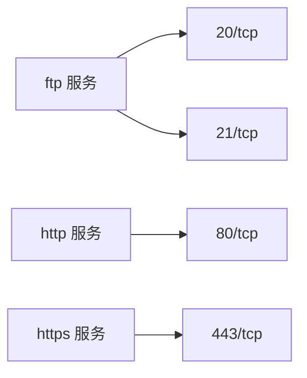
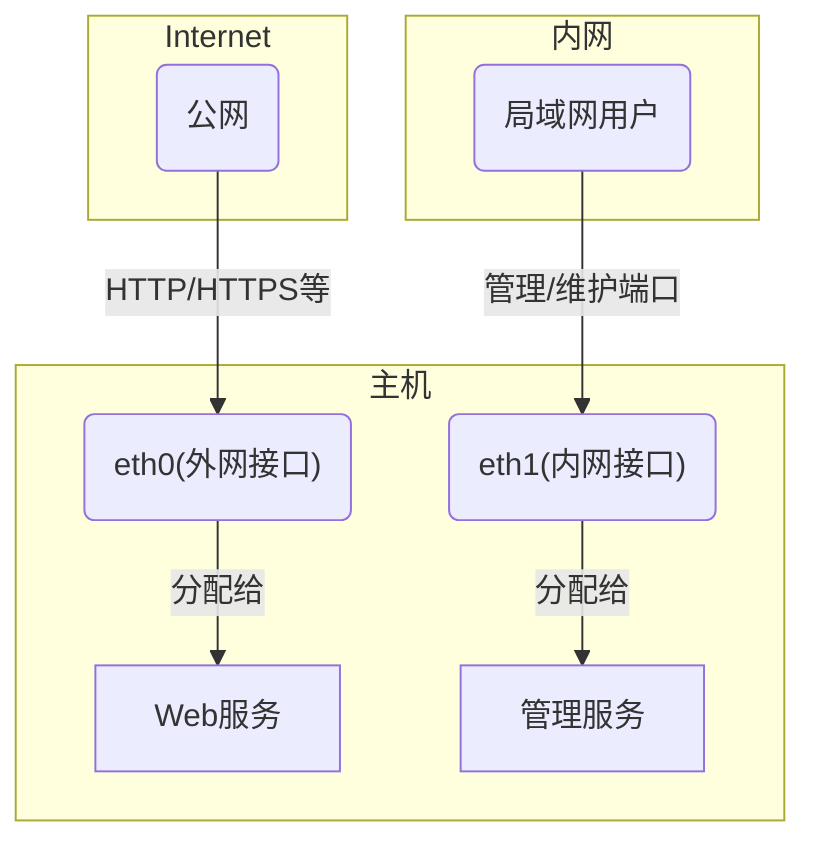
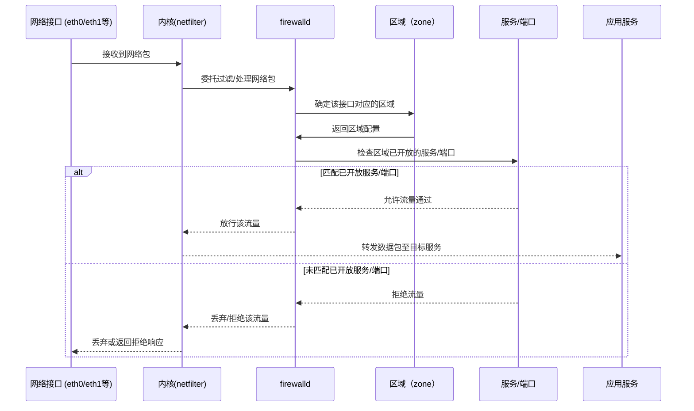

# firewalld概述
防火墙无疑是使用计算机操作系统时绕不开的话题，无论你使用的是Windows、macOS还是Linux。

作者本人的初次“邂逅”，恐怕是在电影里——毕竟在影视剧中，防火墙总带着几分黑客专属的神秘色彩。

日常使用中，常常因防火墙的配置问题，导致服务无法正常访问。曾经，我对防火墙抱有满满的崇拜心理，只因为那时觉得，这是只有电影里的黑客才会触碰的技术。

当然，这篇文章远没有影视情节那般惊险刺激，本文尽可能的站在小白视角展开，不会涉及晦涩难懂的专业内容。

firewalld本质上是一款防火墙前端工具，它的诞生初衷就是简化防火墙规则的编写。有了firewalld之后，用户上手使用防火墙的难度，已经得到了大幅降低。

而在firewalld背后，真正支撑其实现防火墙功能的核心，是Linux系统内核中的第四代防火墙——netfilter。

## 前言

### 对读者前提假设

这里默认读者具备以下基础：
-  熟悉Linux操作系统的基本使用
-  熟悉网络程序的运行机制
-  了解 传输层/IP 网络协议工作原理


### 软件环境说明

> 本文内容仅针对预装/已安装firewalld的Linux发行版（重点适用于RedHat家族，如CentOS、RHEL等）

### 参考连接

- [firewalld文档](https://firewalld.org/documentation/concepts.html)

## 防火墙是什么
防火墙在不同应用场景下有不同的定义，笼统来说，它是架设在**信任网络**与**不可信网络**之间的一道安全屏障，专门用于管控网络流量的进出。

防火墙因网络安全的需求而诞生。早期的网络，核心作用是实现各计算机之间的信息共享，而随着网络规模不断扩大，这些由网络连接的主机之间，开始出现以破坏信息真实性、可用性为目的的恶意行为。

比如，向某台无辜主机发送海量无效数据请求，这会导致该主机耗尽大量计算资源来应对这波“信息洪流”，最终无法正常处理合法的信息数据，这就是典型的DoS攻击，也是对正常网络通信的严重破坏。

为了保障主机在网络中的正常通信，一种专门管控网络信息流、保障传输稳定的设备应运而生。这类设备早期被称为网关，而如今通俗意义上的网关，更多是指承担特定业务的应用网关。

<figure>
  
  <figcaption style="text-align:center;">防火墙示意图</figcaption>
</figure>

随着技术的迭代升级，为了提升网络传输能力，一台主机可以同时接收来自多个不同路由器的网络数据，这也就意味着，主机具备了[多个网络接口](https://info.support.huawei.com/computing/server3D/res/server/taishan1280/index.html?lang=cn)。

<figure>
  
  <figcaption style="text-align:center;">华为服务器——具备多个网络接口的服务器示例</figcaption>
</figure>

如果不仔细区分，你很容易将这种具备多网络接口的主机误认为是路由器。这里需要特别说明的是，路由器本质上也是一款计算机操作系统，只不过它被专门设计用于处理网络数据转发，在软件架构和硬件配置上，都与通用计算机存在明显区别。

本文的讨论场景，限定在**操作系统内核与网络接口之间**。具体来说，计算机接收到的网络数据，需要经过多层协议栈处理，而防火墙就是数据进入系统后的第一道“安检关卡”，它会根据预设规则，判断来自网络的信息是否可以继续进入系统内部进行后续处理。

在这个场景中，计算机内部可视为“信任网络”，而从路由器到计算机网络接口之间的部分，都属于“不可信任网络”。

## 为什么叫防火墙
正如前文所述，计算机可能会遭遇突如其来的“信息洪流”攻击（如DoS、DDoS），这种攻击就像洪水猛兽或突发大火一样，会对主机的正常运行造成毁灭性打击。

而防火墙，就像一堵能抵御火灾蔓延的防火隔离墙，专门用于阻挡这类网络攻击和恶意信息洪流的入侵，“防火墙”这个名字，正是对其抵御网络灾害、保障系统安全功能的生动诠释。

## 防火墙历史
| 阶段   | 核心组件      | 活跃年份（约） | 主要内核版本  | 关键特性                                                                                       |
| ------ | ------------- | -------------- | ------------- | ---------------------------------------------------------------------------------------------- |
| 第一代 | ipfwadm       | 1994-1998      | 1.1/2.0       | 基础包过滤功能，移植自BSD系统，操作直接但扩展性较差。                                          |
| 第二代 | ipchains      | 1998-2001      | 2.2           | 引入“链（Chains）”结构，支持更复杂的规则编排与逻辑控制。                                       |
| 第三代 | iptables      | 2001-2014      | 2.4/2.6/3.x   | 里程碑式升级：引入Netfilter框架，支持连接状态检测（Connection Tracking），功能扩展性大幅提升。 |
| 第四代 | nftables      | 2014-2023      | 3.13/4.x/5.x  | 采用内核虚拟机架构，显著提升规则查找效率，实现多协议统一管理。                                 |
| 第五代 | eBPF/bpfilter | 2020-2026+     | 5.0/6.x及以上 | 当前发展阶段：具备极致硬件加速能力与动态编程特性，支持AI驱动的自动化安全防御。                 |

## firewalld
本文的核心内容，是介绍基于`netfilter`框架实现的`firewalld`防火墙工具。


> Firewalld是一款简单易用、支持状态检测、基于区域划分的防火墙工具。它以“策略”和“区域”为核心组织防火墙规则，将网络在逻辑上划分为多个安全区域，区域之间的网络流量可通过预设策略进行精细化管理。

<figure>
  
  <figcaption style="text-align:center;">firewalld架构图</figcaption>
</figure>

**架构图参考资料**

- [firewalld文档](https://firewalld.org/documentation/architecture.html)

不过，firewalld的“简单易用”是有代价的——它无法完全发挥netfilter的全部底层功能，仅能提供基于**网络端口**和**传输层协议**（TCP/UDP）层面的网络流量控制能力。

与之类似，`RedHat` 家族之外的 `Ubuntu` 系统，也提供了ufw防火墙工具，它同样基于网络端口和传输层协议，实现对网络流量的审查与管控。

下文将介绍其涉及的**关键概念**


## 接口
接口通常指系统能够识别的网络接口，对应现实中的物理设备，比如网线插孔（以太网接口）、无线网卡接口等。

实际上，除了物理接口，还可以通过系统内核创建**逻辑接口（虚拟接口）**。虚拟接口可以模拟路由表功能，发往虚拟接口的网络数据，最终会通过虚拟路由表，转发到对应的物理网络接口上，实现数据的正常传输。

一般情况下，一个网络接口会绑定一个IP地址。在RedHat生态系统中，还提供了NetworkManager工具，专门用于管理系统中的各类网络接口。

## 端口/网络程序/服务
在计算机上运行的、需要与外部网络进行信息交换的程序，都可以统称为**网络程序**。即便是一些以本地运行为主的“单机游戏”进程，若需要通过网络同步游戏进度、下载更新包，也属于网络程序的范畴（即便它由多个子线程组成）。

这些网络程序中，有的以主动发送网络数据为主，有的则以被动等待网络数据连接为主。其中，**以等待网络数据连接、提供特定功能为核心的程序，可称为网络服务（即程序层面的服务器）**。

这些网络服务在运行时，通常会占用计算机的某个**逻辑端口**（由系统或软件动态分配或静态指定）。它们会持续监听对应传输层（TCP/IP协议栈第4层）协议的数据请求，当数据到达指定逻辑端口后，即可实现网络信息的接收与交互。

需要注意的是，部分网络程序/服务可能会同时开放多个逻辑端口，以满足不同的功能需求（比如FTP服务需要同时使用20号和21号端口）。

在 firewalld 中，这些服务所依赖的恒定或一个变化区间的逻辑端口，通常会被组合/划分为一个服务标签，这些标签一般以软件名称命名。例如，`ftp` 服务对应了 `20` 号和 `21` 号端口，而 http 服务对应 80 号端口，https 服务对应 443 号端口，它们的组合标签也是服务的名称。

下面这个 mermaid 图表示了常见服务与其涉及的端口归属关系：



通过这样的标签关联机制，`firewalld` 可以方便地管理和控制一组相关端口的数据流量。


## 网络区域/信任级别

**区域（Zone）**的核心目的，是将一组相关的网络程序/服务，划分为一个逻辑分组，再将这个逻辑分组与实际的网络接口进行绑定。

通常情况下，一个区域可以绑定多个网络接口，但一个网络接口只能绑定到一个区域（确保流量归属的唯一性）。

如前文所述，网络程序/服务通常对应一个或多个端口。`firewalld` 的设计亮点之一，就是将数字形式的逻辑端口，抽象为具有实际含义的**网络/程序服务标签**。这样一来，用户无需记忆某个服务对应的具体端口号，只需记住服务标签，即可实现对对应端口的管控。

例如，可以从ftp服务标签中，永久删除其默认占用的20号TCP端口：
```bash
firewall-cmd --permanent --service=ftp --remove-port=20/tcp
```

也可以为ftp服务标签，添加20-21号TCP端口段（满足FTP服务的正常运行需求）：
```bash
firewall-cmd --permanent --service=ftp --add-port=20-21/tcp
```

给一组端口打上服务标签的直接好处，就是简化了管理成本——标签比易变的端口号更容易记忆。端口号之所以会变化，可能是为了规避恶意端口扫描，也可能是为了在一台主机上运行多个同类服务（避免端口冲突）而手动修改，此时标签的稳定性优势就尤为突出。

假设某台主机有两个网络接口：一个用于对外提供网页服务，一个专门用于私有局域网内部管理。针对这种场景，主机就需要划分两个不同的网络区域：面向公网的区域需要严格管控流量（低信任级别），而面向内网的管理区域则可以适度放开权限（高信任级别）。



如上所示，eth0（外网接口）通常会被分配到“public”（公共区域）或“dmz”（隔离区），用于向公网提供Web服务；而eth1（内网接口）则会被分配到“internal”（内部区域）或“trusted”（信任区域），仅允许局域网用户通过管理端口（如22号SSH端口）访问管理服务。

不同区域之间存在严格的隔离机制，来自public区域的请求，无法直接访问internal区域的资源。也就是说，通过eth0接口无法访问22号管理端口，因为22号端口归属internal区域，而eth0绑定在public区域，二者属于不同的信任级别，不允许流量随意窜通。

这就像自己不会允许陌生人（不可信对象）随意进出自己的房间（可信区域）一样，即便服务器同时开放了公网服务端口和内网管理端口，不同区域之间的流量也会被防火墙严格隔离，保障系统安全。

为了更直观地理解区域隔离的作用，举一个实际例子：
在public区域中，服务器主机只开放443号端口（HTTPS协议），这样通过eth0接口进入的网页请求，就能正常被Web服务接收和处理，并返回正常的网页内容。作为网站管理员，可以通过内网（internal区域）的22号SSH端口，远程登录服务器修改网页内容，这是预先规划的合法操作。

假设有恶意攻击者，想要通过eth0接口（公网访问入口）尝试连接22号管理端口，进而篡改网页内容。但由于eth0绑定的public区域，并未开放22号端口的访问权限，攻击者的连接请求会被防火墙直接礼貌拒绝或直接不搭理，这就是网络区域（信任级别）带来的安全防护作用。

### 内置区域

以下是 firewalld 提供的区域，按区域的默认信任级别从不受信任到受信任排序：

**drop**
所有传入的网络数据包都会被丢弃，不会收到任何回复。只允许建立传出的网络连接。

**block**
任何传入的网络连接都会被拒绝，IPv4 请求会返回 icmp-host-prohibited 消息，IPv6 请求会返回 icmp6-adm-prohibited 消息。只有本系统内部发起的网络连接才被允许。

**public**
仅限公共区域使用。您不信任网络上的其他计算机不会损害您的计算机。仅接受选定的传入连接。

**external**
适用于启用了 IPv4 地址伪装的外部网络，尤其适用于路由器。您不信任网络上的其他计算机不会对您的计算机造成损害。仅接受选定的传入连接。

**dmz**
对于位于非军事区内、可公开访问但对您的内部网络访问权限有限的计算机，仅接受选定的传入连接。

**work**
适用于工作区域。您基本信任网络上的其他计算机不会损害您的计算机。仅接受选定的传入连接。

**home**
适用于家庭环境。您通常信任网络上的其他计算机不会损害您的计算机。仅接受选定的传入连接。

**internal**
仅供内部网络使用。您基本可以信任网络上的其他计算机不会损害您的计算机。仅接受选定的传入连接。

**trusted**
所有网络连接均被接受。


如果想要查看某个区域所开放的服务, 可以使用以下格式

```bash
irewall-cmd --zone=zonename --list-services 
```

例如查看公共区域(public)所能访问的服务

```bash
irewall-cmd --zone=public --list-services 
```

### 运行逻辑

下面通过一幅 mermaid 时序图描述流量从网络接口进入，firewalld如何依据区域、策略、服务等步骤进行流量流转和判断：



**说明**：

- 每个网络接口（NIC）在 firewalld 中都会被绑定到某个“区域”（zone），如 public、internal 等。
- firewalld 首先判断流量来源自哪个接口，然后查找该接口所属的区域配置。
- 区域内定义了允许开放的服务（如 http/https/ssh等）和端口。
- 流量只有匹配到开放的服务/端口才会被允许，未匹配到则被拒绝或丢弃。
- 最终，只有合法、匹配规则的网络流量才会进入操作系统中对应的应用服务处理。

这样实现了基于接口+区域+服务的多级网络流量安全管控。


## 策略/规则
所谓策略，本质上是用于定义**两个不同区域之间的网络流量如何跳转、是否允许通行**的规则集合。该部分内容较为复杂，本文暂不展开详细介绍。


## ipSet

ipset 通常是一些 IP 对象的集合，这些对象不仅可以是单个 IP 地址，还可以是多个格式，例如：
- 单个 IP 地址（如 192.168.1.1）
- 多个 IP 地址的网段（如 10.0.0.0/24 类似的 CIDR 格式）
- IP 地址范围（如 192.168.1.100-192.168.1.200）
- 还可以是完整的子网甚至 IP + 端口、IP + MAC 组合等（根据 ipset 类型区分）

这样定义的 ipset 集合，可以被防火墙用在区域（zone）、服务、规则、甚至是策略（policy）等多种场景，更灵活高效地批量管理允许/拒绝的 IP 数据列表。

## 临时和永久规则状态
firewalld通过区域和策略，实现对网络流量的各类处理（拒绝、丢弃、转发、继续处理等）。同时，它还提供了**临时规则状态**，用于测试新的区域配置或策略是否能正常运转。

临时规则的特点是“即时生效”，修改后无需重启防火墙即可生效，但它的生命周期仅限于当前防火墙运行进程——一旦防火墙重启或系统重启，临时规则会全部失效，系统会自动加载**永久规则配置**。

如果根据临时修改的防火墙, 经测试后确认后可按照预想的规则运行，需要将其保存为永久规则，此时可以执行以下命令：
```bash
$ sudo firewall-cmd --runtime-to-permanent
```

