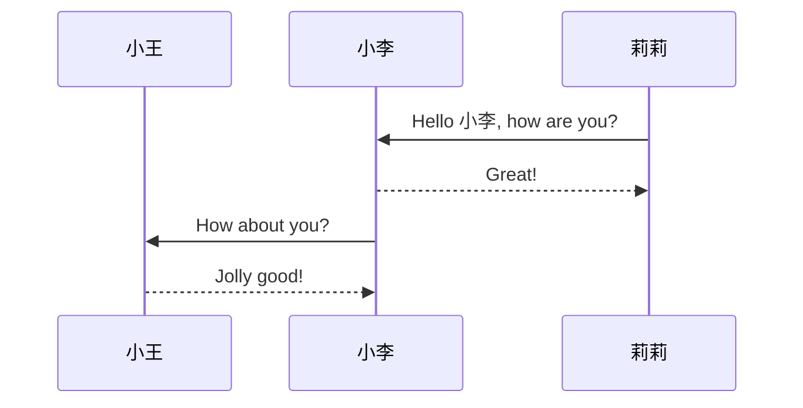
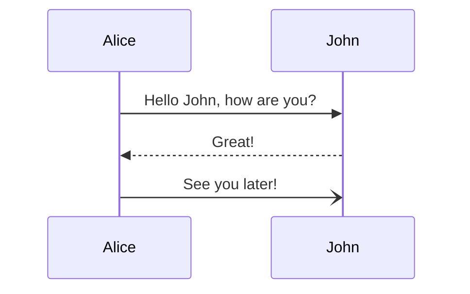

```mermaid
---
sequence:
    showSequenceNumbers: true
---
sequenceDiagram
    participant 小王
    participant 小李
    participant 莉莉

    links 莉莉: 案例 @ https://remix:lucardo.website
    links 莉莉: 笔记 @ https://notes:lucardo.website
    %% links 小王: 官网 @ https://fresh.lucardo.website
    %% 高级语法: links <参与方名称>: <json格式键值对>
    %% links 小李: {"笔记":"https://notes:lucardo.website", "案例": "https://remix:lucardo.website","fresh":"https://fresh.lucardo.website"}
    %% links 莉莉: {"Dashboard": "https://dashboard.contoso.com/alice", "Wiki": "https://wiki.contoso.com/alice"}
    %% links 小王: {"Dashboard": "https://dashboard.contoso.com/john", "Wiki": "https://wiki.contoso.com/john"}
    %% autonumber
    莉莉->>小李: Hello 小李, how are you?
    %% loop HealthCheck
    %%     小李->>小李: Fight against hypochondria
    %% end
    %% Note right of 小李: Rational thoughts!
    小李-->>莉莉: Great!
    小李->>小王: How about you?
    小王-->>小李: Jolly good!


```

```mermaid
sequenceDiagram
    participant Alice
    participant John
    link Alice: Dashboard @ https://dashboard.contoso.com/alice
    link Alice: Wiki @ https://wiki.contoso.com/alice
    link John: Dashboard @ https://dashboard.contoso.com/john
    link John: Wiki @ https://wiki.contoso.com/john
    Alice->>John: Hello John, how are you?
    John-->>Alice: Great!
    Alice-)John: See you later!

```