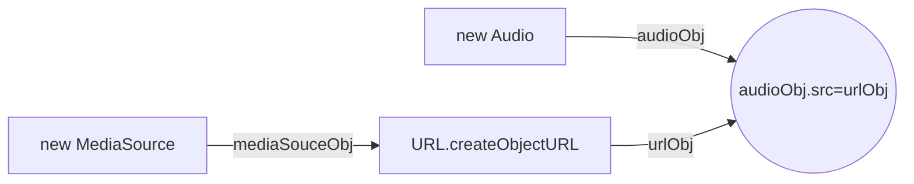
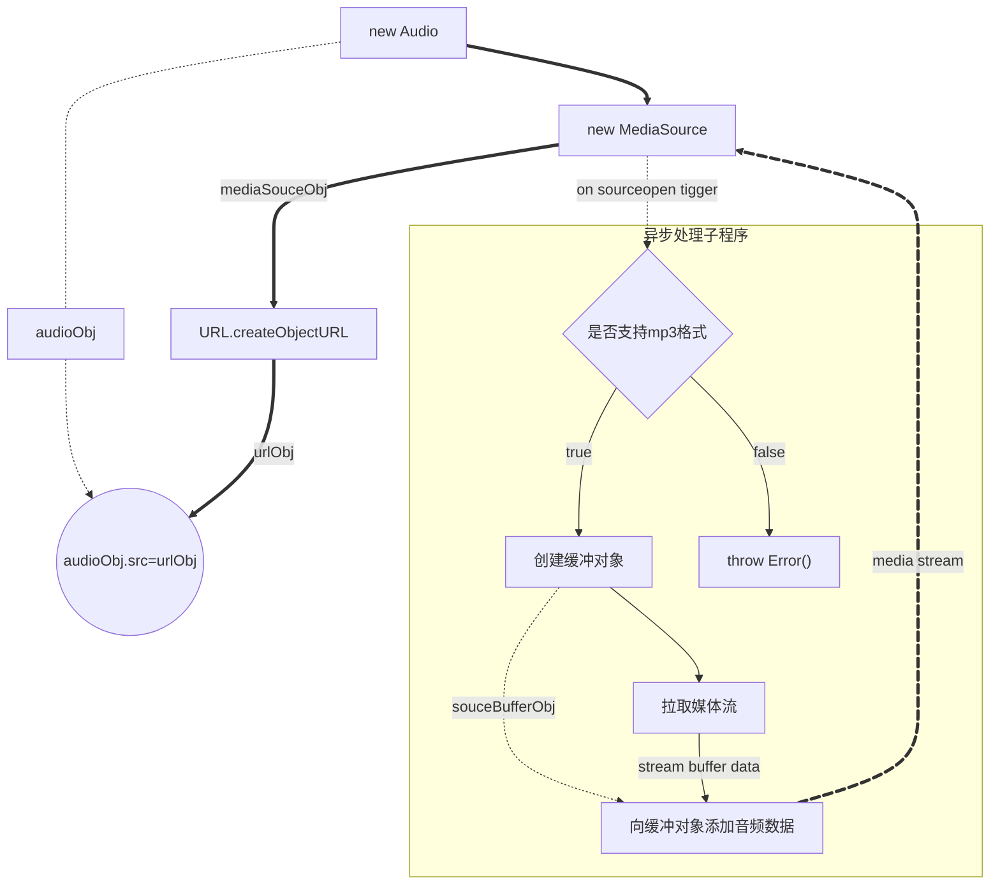

# Stream 与音频播放技术

使用异步请求加载流式数据，实现边加载边播放的功能。

## 说明

想要流畅阅读本文，需要读者具备以下知识储备：

- 熟悉 [Stream API](https://developer.mozilla.org/zh-CN/docs/Web/API/Streams_API)
- 熟悉 [fetch API](https://developer.mozilla.org/zh-CN/docs/Web/API/Window/fetch): [使用fetch](https://developer.mozilla.org/zh-CN/docs/Web/API/Fetch_API/Using_Fetch)
- 熟悉 [react](https://zh-hans.react.dev/)
- 了解 [ECMAScript 2024](https://tc39.es/ecma262/2024/)
- 了解 [Media Source Extensions API](https://developer.mozilla.org/zh-CN/docs/Web/API/Media_Source_Extensions_API)

**参考链接**

- [浅谈 audioContext 音频上下文 - CSDN](https://blog.csdn.net/2301_79280768/article/details/146991572)
- [AudioContext 入门 - 稀土掘金](https://juejin.cn/post/6962380242497306638)
- [流式音频播放](https://juejin.cn/post/7500121659090321442)

**写作动机**

工作中遇到了类似功能逻辑，初次看到时，就觉得其代码不够优雅，主要体现在没有充分运用 Stream 数据流背压技术。

除此之外，我对 [Web 媒体技术](https://developer.mozilla.org/zh-CN/docs/Web/Media) 本身也具有很高的学习热情。因为现代媒体技术已不同于以往使用 Flash 技术的时代，现在相关工作组已经将技术规范标准化。

国内由于各种原因并未采用相关标准实现在线直播或语音聊天，这让我感觉很失落。最近两天花了点时间学习了相关概念，虽然仅限皮毛且仅限于音频技术，但已足以应付工作中的相关问题，更重要的是通过写作记录加深印象。

Web 媒体技术涉及诸多概念，本文主旨在于介绍以下场景：

当播放源不能通过地址简单获取数据流时的情况。例如，需要在请求头中加上 Authorization 请求头，且不知道音频长度时，实现一边播放一边拉取音频数据。

此类情况适用于需要权限查看的音频或来自服务器的合成音频。对于一开始就已知音频长度、可以一次性将数据流拉取完再播放的情况，不适用于本文。

本文案例也可用于网络情况不佳但又需要及时播放的场景。同理，也适用于网络情况良好但带宽不够时，实现加载高负载的播放内容，减轻客户端加载压力。


## 技术运用级别


本质上, 使用到媒体播放一般有两类技术级别.

1. 单纯用于播放音频
2. 对音频进行处理和分析

第一类用于 `单纯音频播放`, 例如可能从某个静态文件地址, 或者从通过某个接口返回的音频数据流播放音频.
第二类则是 `更高级的需求`, 例如: 调整音频效果, 或者为了分析音频音谱, 而是否播放音频则可能是次要的.

对于本文的初版, 仅为处理 `dify` 的语音合成播放而写的. 后来, 经过详细了解后, 发现初版仅仅为了播放远程数据, 根本就不需要用到AudioContext, 因为该对象是为了处理更高级的需求.

由此, 本文在 `2025年11月22日` 进行了调整:

- 增加 `MSE API` 播放与案例
- 调整 `AudioContext` 案例
- 增加外部资料连接

下文, 我将介绍两类需求级别

## 单纯播放音频

对于简单播放需求的情况, 也分两类播放源, 第一种是已经存在一个静态地址, 可以获得媒体源. 对于此类情况, 只需要使用`<audio/>`即可满足需要

例如

```html
<audio controls>
  <source src="file.mp3" type="audio/mpeg" />
</audio>
```

**通过异步请求mp3**则不同, 此种情况用于请求音频流时, 发起方需要携带一大堆数据的情况. 通过异步请求返回的音频数据流作为音频原, 进行播放.

> [!WARNING]
> 采用异步加载的方法, 不被firefox所支持, 原因在于 MSE 不支持纯 MP3，因为 MP3 不是分段媒体格式。
> 因此,在在firefox这样相对来说更加注重标准本身的浏览器上无法正常使用!
> 但是能在 基于 chrome 内核的浏览器上使用
> 如果想要使用 MSE 播放, 推荐将mp3格式封装在mp4容器中, 或者将mp3文件格式化为acc格式(`m4a.40.2`)



基本流程如上所示, 需要着重关注的对象应该是MediaSouce, 因为创建后, 还需要将异步请求的媒体源对接到该对象之上.

但是在对接前, 需要等待MediaSouce准备完毕才行. 通过监听MediaSouce触发的souceopen事件, 则表示mediaSouce已经准备好接受 异步数据流了

```typescript
// 音频流缓冲对象
let sourceBuffer: SourceBuffer | undefined

medisSouce.addEventListener('sourceopen', async () => {
  console.log('mediaSourceManager 已准备好接收数据', mediaSourceManager.readyState);
  if (sourceBuffer) { return }

  if (MediaSource.isTypeSupported('audio/mpeg')) {
    sourceBuffer = medisSouce.addSourceBuffer('audio/mpeg')
    // 在这里为SouceBuffer添加数据流
  } else {
    throw new Error('浏览器不支持任何 MSE 音频格式。请使用 MP4 容器格式的音频文件（AAC 或 MP3 in MP4）。')
  }
})
```
此处引入了一个新的概念,称为 SouceBuffer, 一个mediaSouce是可以添加多个缓冲区的. 相当于可以存在数个缓冲.

根本上, 通过异步数据返回的流, 是添加在缓冲区对象中的. 通过缓冲对象与 mediaSouce, 实现数据流传输到 audio 中进行播放.

接下来, 通过ui操作实现对SouceBuffer添加音频数据流.

```tsx
<Button onClick={() => {
  loadMp3()
}}>
  加载
</Button>
<Button disabled={!loaded} onClick={() => play()}>
  播放
</Button>
<Button onClick={() => audio?.pause()}>
  暂停
</Button>
```
```typescript
/**
 * 通过promise实现等待缓冲更新完成事件
 */
async function awatingSourceBuffer() {
  const { resolve, promise } = Promise.withResolvers<void>()
  sourceBuffer?.addEventListener('updateend', () => resolve(), { once: true })
  return promise
}
function loadMp3(url?: string) {
  if (loaded) {
    return
  }
  fetch(url ?? '/assets/a.mp3',).then(async res => {
    if (!res.body) {
      return
    }
     const writerStream = new WritableStream({

      start(controller) {
        console.log('开始接受媒体流数据');
      },
      async write(chunk, controller) {
       while (sourceBuffer?.updating) {
          // 等待更新状态稳定
          console.log('sourceBuffer 正在更新, 等待更新完成');

          await awatingSourceBuffer()
        }

        const arrayBuffer = chunk.buffer

        console.assert(!sourceBuffer?.updating, 'sourceBuffer 处于异常更新状态')

        sourceBuffer?.appendBuffer(arrayBuffer);
        console.log('写入sourceBuffer完成, 写入大小:', arrayBuffer.byteLength);

      },
      async close() {
        console.log('音频数据已接收完毕');
        loaded = true
        while (sourceBuffer?.updating) {
          console.log('sourceBuffer 正在更新, 等待更新完成');
          await awatingSourceBuffer()
        }
        console.log('结束数据流 , 将数据流写入sourceBuffer完成,开始endOfStream');
        mediaSourceManager.endOfStream();
      },
      abort(reason) {
        console.log('SourceBuffer WritableStream aborted:', reason);
      }
    })
    res.body.pipeTo(writerStream)
  })
}
```




## 更高级需求


### AudioContext

AudioContext 本质上是为音频处理工作流提供一个程序空间（上下文），用于声明音频源、音频处理（增益）顺序以及音频播放的过程。因此，在开始处理任何音频前，应该创建一个 AudioContext。

AudioContext 继承于 BaseAudioContext，所以很多 BaseAudioContext 的方法也能在 AudioContext 中使用，比如 `decodeAudioData` 方法，用于将原始的 ArrayBuffer 解码后返回音频数据（返回的也是 ArrayBuffer）。本文不会涉及该方法的使用。

本文也不会涉及 BaseAudioContext 的使用案例。

### AudioNode

本文不会对音频增益（AudioNode）部分进行过多的案例展示与介绍。

### MediaSource

播放方式有很多种，比如本文涉及到的 Audio 播放器对象，可以在创建实例时传入一个音频地址，实现对音频直接控制作用。

本质上，通过初始化 Audio 传入播放地址的行为，与在 `<audio>` 标签加上 `src` 字符串属性没有太大区别。

因此，当以上条件不满足，又不想基于其他插件获得流媒体功能时，就需要通过 [MSE API](https://developer.mozilla.org/zh-CN/docs/Web/API/Media_Source_Extensions_API)，以纯 JavaScript 方式获得媒体串流。

MediaSource 正是为了通过 JavaScript 创建媒体串流而设计的。

### AudioDestinationNode

该对象继承于 AudioNode，但着重于描述一个 AudioContext 音频处理的出口，即对音频进行最后播放（最后一个处理节点），播放后就是耳朵听到的声音，程序再无后续处理。

默认情况下，AudioContext 实例有一个 `destination` 属性，就是该对象。


### 处理流程图

### ReadableStream

本文演示案例是基于 fetch API 实现的获取 MP3 音频。

fetch API 返回结果为 Response 对象，表示一个 HTTP 响应。当响应大且耗时时，甚至大到无法一次性存储完（近乎无限），就不能完全等待这个响应数据流。

因此，Response 对象有一个 `body` 属性，用于处理获取的数据近乎无限的情况，将其视作涓涓流水（山泉/水龙头），源源不断流出，流出一部分就处理一部分。

这是实现一边播放一边获取音频的核心要点。

## 实现

特别说明：本文案例通过限制网络加载速度模拟一边播放一边加载的场景。音频文件本身不大，但将网络速度限制得很低，导致长时间无法加载完成，以此比喻网络加载慢的场景。

此时就需要一边加载一边播放，以保证用户端获得良好的使用体验。

### 流媒体服务器

主要代码文件结构如下：

```
.
├── README.MD
├── apps
│   ├── a.mp3
│   ├── b.mp3
│   └── mp3.ts
├── deno.json
├── deno.lock
└── main.ts
```

`main.ts` 为整个服务器入口文件，关键代码如下：

```typescript
import { H3, serve } from "h3";
import mp3Response from "./apps/mp3.ts";

const app = new H3();
app.mount("/mp3", mp3Response);
serve(app, { port: 3000 });
```

其中 `mp3.ts` 是返回 MP3 音频的全部代码，如下所示。需要注意的是，MP3 文件在服务端是按照 Stream 流式返回的。

```typescript
import { H3, defineHandler, getRouterParam } from "h3";

const app = new H3();

app.get("/:filePath", defineHandler(async (event) => {
  const filepath = getRouterParam(event, "filePath") as string;
  const path = [import.meta.dirname, filepath?.replace(/^\//, '')].join('/');
  
  try {
    const file = await Deno.open(path, { read: true });
    return new Response(file.readable, {
      headers: {
        "Content-Type": "audio/mpeg",
      },
    });
  } catch (error) {
    console.error(error);
    return Response.json({
      message: 'only mp3 file a.mp3 and b.mp3 is supported',
    }, {
      status: 404,
    });
  }
}));

export default app;
```

### AudioContext

如前文概念所述，AudioContext 是处理音频的关键对象，音频处理的所有过程均在 AudioContext 程序空间中进行。因此首先应创建 AudioContext 对象：

```typescript
const audioContext = new AudioContext();
```

### MediaSource

```typescript
const mediaSourceManager = new MediaSource();
```

### 建立处理逻辑

现在要指定 AudioContext 如何处理各个 AudioNode 的前后关系，代码如下：

```typescript
const audio = new Audio();
audio.src = URL.createObjectURL(mediaSourceManager);
audio.autoplay = true;

const audioSourceNode = audioContext.createMediaElementSource(audio);
audioSourceNode.connect(audioContext.destination);
```

此处建立的逻辑关系有点复杂：

使用 Audio API 主要是为了控制播放与音频播放行为。将 MediaSource 通过 `URL.createObjectURL` 赋值给 `src`，是因为很多浏览器不支持 `srcObject` 的赋值方式，作为回退才这么使用。

然后通过 `AudioContext.createMediaElementSource(audio)` 创建一个音频源 AudioNode，最后将该音频源 AudioNode 直接连接到播放器（即 AudioDestinationNode）。

这样，通过 MediaElementAudioSourceNode 直接到 AudioDestinationNode 的音频处理关系就完成了，没有任何中间的音频增益处理节点，完成了最简单的 AudioContext 音频处理关系的建立。

至此，基本程序准备完毕，但还没有为准备好的程序输入音频，也就是为 MediaSource 添加音频数据。

### 创建音频数据流接收对象

现在 MediaSource 只能算一个媒体源管理对象，用于管理多个音频源。因此要添加音频源，必须通过管理对象指定。

特别要注意的是，在管理对象创建之前，必须等待该对象已经准备好才能创建源，否则程序将会报错。换句话说，必须等待管理器准备好接受数据源时才能创建源。

```typescript
let sourceBuffer: SourceBuffer;

mediaSourceManager.addEventListener('sourceopen', async () => {
  console.log('sourceopen', mediaSourceManager.readyState);
  if (sourceBuffer) return;
  sourceBuffer = mediaSourceManager.addSourceBuffer('audio/mpeg');
});
```

这样，就通过 `mediaSourceManager` 创建了一个音频接收对象，该对象可以通过 `appendBuffer` 方法添加（处理/消费）不断流入的音频数据流。

### 获得数据流（建立管道）

```typescript
let loaded = false;

function loadMp3(url?: string) {
  if (loaded) return;
  
  kyInstance(url ?? 'mp3/b.mp3').then(async res => {
    if (!res.body) return;
    setupSourceBuffer(res.body);
  });
}
```

### 写入音频数据

```typescript
async function awatingSourceBuffer() {
  const { resolve, promise } = Promise.withResolvers<void>();
  sourceBuffer.addEventListener('updateend', () => resolve(), { once: true });
  return promise;
}

function setupSourceBuffer(readableStream: ReadableStream) {
  const writerStream = new WritableStream({
    start(controller) {
      console.log('开始接受媒体流数据');
    },
    
    async write(chunk, controller) {
      const { resolve, reject, promise } = Promise.withResolvers<void>();
      
      while (sourceBuffer.updating) {
        console.log('sourceBuffer 正在更新，等待更新完成');
        await awatingSourceBuffer();
      }

      const arrayBuffer = chunk.buffer.slice(
        chunk.byteOffset,
        chunk.byteOffset + chunk.byteLength
      );

      try {
        if (sourceBuffer.updating) {
          return reject(new Error('致命错误：sourceBuffer 处于异常更新状态'));
        }
        sourceBuffer.appendBuffer(arrayBuffer);
        console.log('写入 sourceBuffer 完成，写入大小:', arrayBuffer.byteLength);
        resolve();
      } catch (error) {
        reject(error);
      }
      return promise;
    },
    
    async close() {
      console.log('音频数据已接收完毕');
      loaded = true;
      
      while (sourceBuffer.updating) {
        console.log('sourceBuffer 正在更新，等待更新完成');
        await awatingSourceBuffer();
      }
      
      console.log('结束数据流，将数据流写入 sourceBuffer 完成，开始 endOfStream');
      mediaSourceManager.endOfStream();
    },
    
    abort(reason) {
      console.log('SourceBuffer WritableStream aborted:', reason);
    }
  });
  
  readableStream.pipeTo(writerStream);
}
```

## 完整案例

```typescript
// readble.client.ts
import ky from "ky";

const audioContext = new AudioContext();
export let mediaSourceManager = new MediaSource()


function bindAudioEvent(audio: HTMLAudioElement) {
  audio.addEventListener('ended', (e) => {
    console.log('audio ended event', e)
  })

  audio.addEventListener('pause', (e) => {
    console.log('pause event', e)
  })

  audio.addEventListener('play', (e) => {
    console.log('play event', e)
  })

  audio.addEventListener('timeupdate', (e) => {
    console.log('timeupdate event')

  })
}


export let audio = new Audio()
bindAudioEvent(audio)
audio.src = URL.createObjectURL(mediaSourceManager)
audio.autoplay = true


const audioSouceNode = audioContext.createMediaElementSource(audio)

audioSouceNode.connect(audioContext.destination)

export let sourceBuffer: SourceBuffer


mediaSourceManager.addEventListener('sourceopen', async () => {
  console.log('mediaSourceManager 已准备好接收数据', mediaSourceManager.readyState);
  if (sourceBuffer) { return }
  sourceBuffer = mediaSourceManager.addSourceBuffer('audio/mpeg')

})

mediaSourceManager.addEventListener('sourceended', () => {
  console.log('媒体流已结束')
})

mediaSourceManager.addEventListener('sourceclose', () => {
  console.log('媒体流已关闭')
})

const kyInstance = ky.create({
  prefixUrl: '/api',
})
async function awatingSourceBuffer() {
  const { resolve, promise } = Promise.withResolvers<void>()
  sourceBuffer.addEventListener('updateend', () => resolve(), { once: true })
  return promise
}
let loaded = false
function setupSourceBuffer(readableStream: ReadableStream) {
  const writerStream = new WritableStream({

    start(controller) {
      console.log('开始接受媒体流数据');
    },
    async write(chunk, controller) {
      const { resolve, reject, promise } = Promise.withResolvers<void>()
      while (sourceBuffer.updating) {
        // 等待更新状态稳定
        console.log('sourceBuffer 正在更新, 等待更新完成');

        await awatingSourceBuffer()
      }

      const arrayBuffer = chunk.buffer.slice(
        chunk.byteOffset,
        chunk.byteOffset + chunk.byteLength
      );

      try {
        if (sourceBuffer.updating) {
          return reject(new Error('致命错误:sourceBuffer 处于异常更新状态'))
        }
        sourceBuffer.appendBuffer(arrayBuffer);
        console.log('写入sourceBuffer完成, 写入大小:', arrayBuffer.byteLength);
        resolve()

      } catch (error) {
        reject(error)
      }
      return promise
    },
    async close() {
      console.log('音频数据已接收完毕');
      loaded = true
      while (sourceBuffer.updating) {
        console.log('sourceBuffer 正在更新, 等待更新完成');
        await awatingSourceBuffer()
      }
      console.log('结束数据流 , 将数据流写入sourceBuffer完成,开始endOfStream');
      mediaSourceManager.endOfStream();
    },
    abort(reason) {
      console.log('SourceBuffer WritableStream aborted:', reason);
    }
  })
  readableStream.pipeTo(writerStream)
}
export function loadMp3(url?: string) {
  if (loaded) {
    return
  }
  kyInstance(url ?? 'mp3/b.mp3').then(async res => {
    if (!res.body) {
      return
    }
    setupSourceBuffer(res.body)
  })
}
export function play() {
  console.log(audioContext.state);
  if (audioContext.state === 'suspended') {
    audioContext.resume().then(() => {
      console.log('audioContext resumed');
      audio.play()
    })
  } else {
    audio.play()
  }

}

export function pause() {
  audio.pause()
  audioContext.suspend()
}


```

```tsx
// index.tsx
import { Button } from "~/components/ui/button";
import { play, pause, audio, loadMp3 } from "./readble.client";
import { useRef, useState } from "react";
import { useEventListener, useMount } from "@reactuses/core";

export default function Readble() {
  const audioRef = useRef<HTMLAudioElement>(null)
  const [loaded, setLoaded] = useState(false)
  /* useMount(()=>{
    loadMp3()
  }) */
  useEventListener('loadeddata', (e) => {
    setLoaded(true)
  }, audio)
  return <div>
    <audio ref={audioRef} controls>
      <source src="/api/mp3/b.mp3" type="audio/mpeg" />
    </audio>

    <Button onClick={() => {
      audioRef.current?.play()
    }}>
      播放
    </Button>
    <hr />
    <div>media extends api 音频</div>
    <Button onClick={() => {
      loadMp3()
    }}>
      加载
    </Button>
    <Button disabled={!loaded} onClick={() => play()}>
      播放
    </Button>
    <Button onClick={() => audio?.pause()}>
      暂停
    </Button>
  </div>
}
```