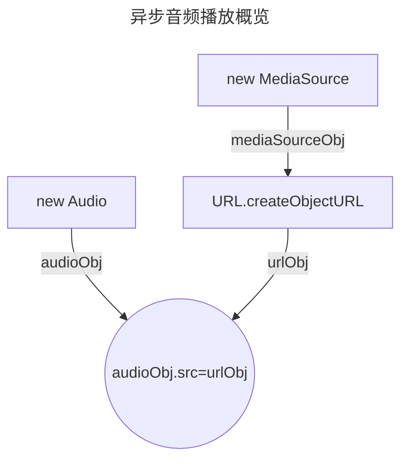
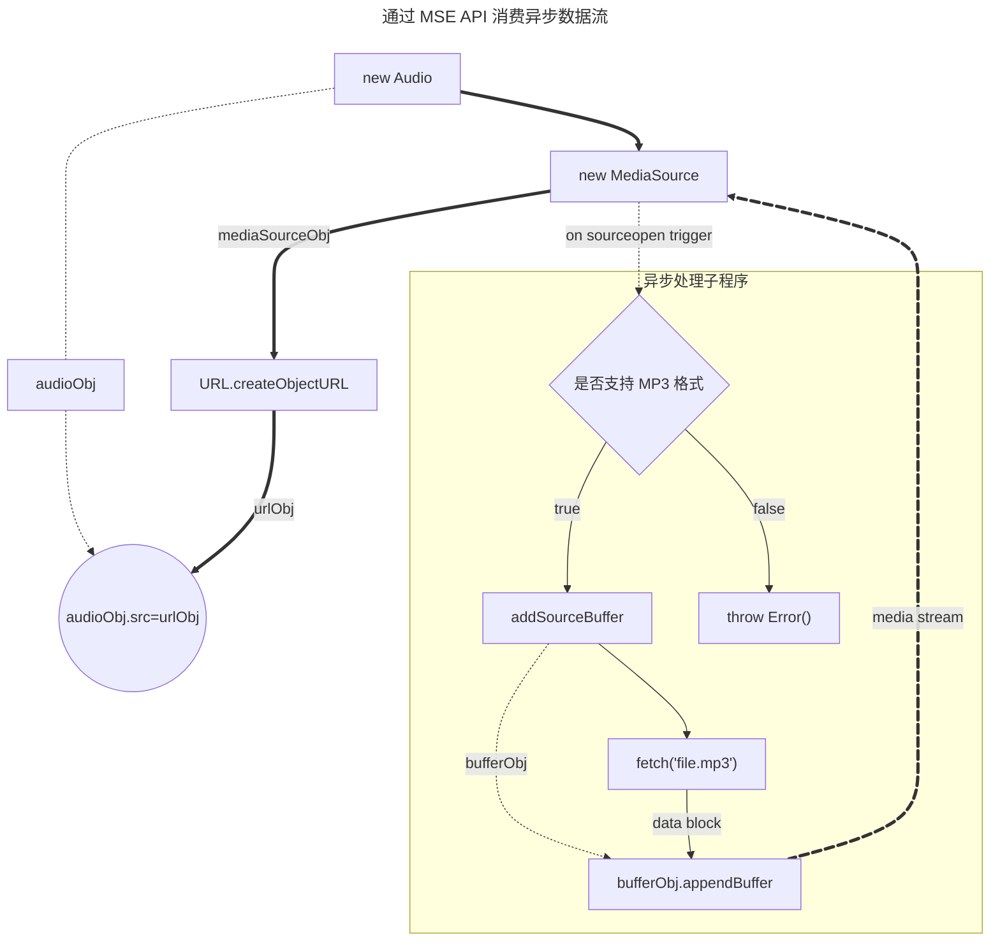
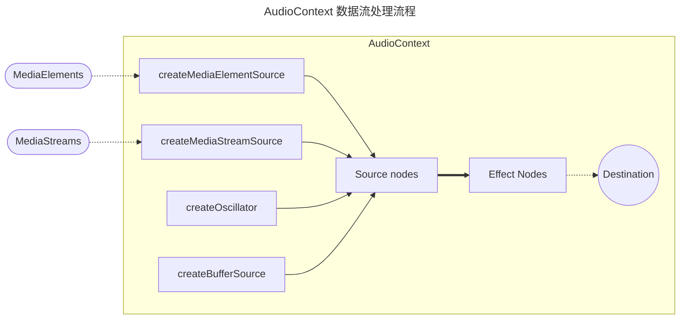
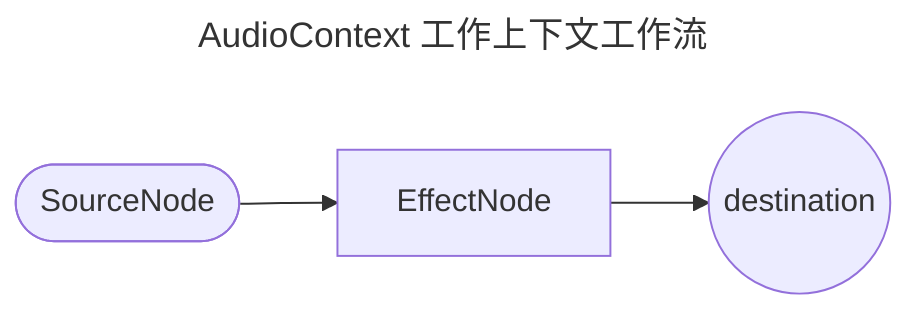
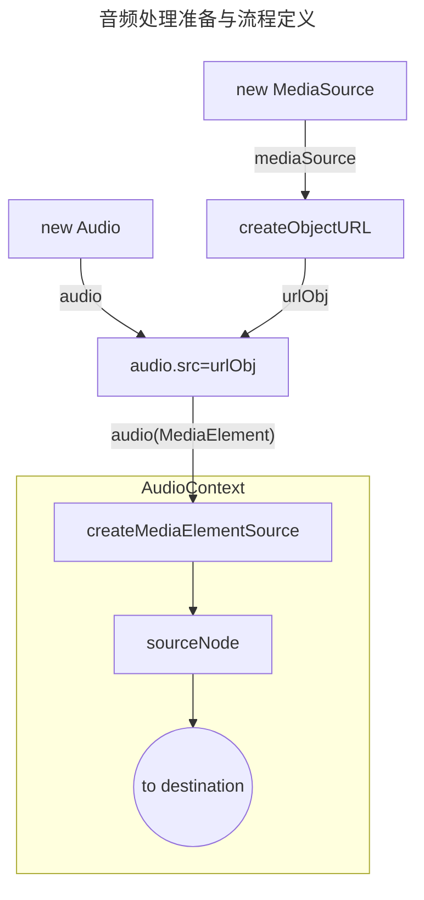

# Stream 与音频播放技术

使用异步请求加载流式数据，实现边加载边播放的功能。


## 说明

想要流畅阅读本文，需要读者具备以下知识储备：

- 熟悉 [Stream API](https://developer.mozilla.org/zh-CN/docs/Web/API/Streams_API)
- 熟悉 [Fetch API](https://developer.mozilla.org/zh-CN/docs/Web/API/Window/fetch)
- 熟悉对象继承概念
- 工程化前端项目经验
- 了解 HTTP 协议及 HTTP 服务器
- 了解 [ECMAScript 2024](https://tc39.es/ecma262/2024/)
- 了解 [Media Source Extensions API](https://developer.mozilla.org/zh-CN/docs/Web/API/Media_Source_Extensions_API)

**参考链接**

- [Media Source Extensions API - MDN](https://developer.mozilla.org/zh-CN/docs/Web/API/Media_Source_Extensions_API)
- [Web Audio API - MDN](https://developer.mozilla.org/zh-CN/docs/Web/API/Web_Audio_API)
- [浅谈 AudioContext 音频上下文 - CSDN](https://blog.csdn.net/2301_79280768/article/details/146991572)
- [AudioContext 入门 - 稀土掘金](https://juejin.cn/post/6962380242497306638)
- [流式音频播放 - 稀土掘金](https://juejin.cn/post/7500121659090321442)

## 前言

工作中遇到了类似功能逻辑，初次看到时，就觉得其代码不够优雅，主要体现在没有充分运用 Stream API 流背压技术。

除此之外，我对 [Web 媒体技术](https://developer.mozilla.org/zh-CN/docs/Web/Media) 本身也具有很高的学习热情。因为现代媒体技术已不同于以往使用 Flash 技术的时代，现在相关工作组已经其规范标准化。

国内由于各种原因并未采用相关标准实现在线直播或语音聊天，这让我感觉些许失望。最近两天花了点时间学习了相关概念，虽然仅限皮毛且仅限于音频技术，但已足以应付工作中的相关问题，更重要的是通过写作记录加深印象。

Web 媒体技术涉及诸多概念，本文主旨在于介绍以下场景：

当播放源不能通过地址简单获取数据流时的情况。例如，需要在请求头中加上 Authorization 请求头，且不知道音频长度时，实现一边播放一边拉取音频数据。

此类情况适用于需要权限查看的音频或来自服务器的合成音频。对于一开始就已知音频长度、可以一次性将数据流拉取完再播放的情况，不适用于本文。

本文案例也可用于网络情况不佳但又需要及时播放的场景。同理，也适用于网络情况良好但带宽不够时，实现加载高负载的播放内容，减轻客户端加载压力。

> [!NOTE]
> 对于本文的初版，仅为处理 `dify` 的语音合成播放而写的。后来，经过详细了解后，发现初版文章内容理解有所偏差，且技术需求用不上初版文章中所涉及到的 AudioContext API。
> 由此，本文在 `2025年11月22日` 进行了调整：
> - 增加 `MSE API` 播放与案例
> - 调整 `AudioContext` 案例
> - 增加外部资料引用


本文内容可[访问案例](https://remix.lucardo.website/blogs/mse)预览运行效果

## 一、技术需求级别

本质上，使用到媒体播放一般有两类技术级别：

1. 单纯用于播放音频
2. 对音频进行增幅处理和分析

第一类用于 **单纯音频播放**，例如可能从某个静态文件地址，或者从通过某个接口返回的音频数据流播放音频。第二类则是 **更高级的需求**，例如：调整音频效果，或者为了分析音频音谱，而是否播放音频则可能是次要的。

下文，将介绍两类需求级别。

## 二、简单播放音频

对于简单播放需求的情况，也分两类播放源，第一种是已经存在一个静态地址，可以获得媒体源。对于此类情况，只需要使用 `<audio>` 即可满足需要。

### HTML 标签播放

最简单的音频播放采用如下标签格式即可。

例如：

```html
<audio controls>
  <source src="file.mp3" />
</audio>
```

### 异步请求音频数据

**通过异步请求 MP3** 则不同，此种情况用于请求音频流时，发起方需要携带一大堆数据的情况。通过异步请求返回的音频数据流作为音频源，进行播放。

> [!WARNING]
> 采用异步加载的方法，不被 Firefox 所支持，原因在于 MSE 不支持纯 MP3，因为 MP3 不是分段媒体格式。
> 因此，在 Firefox 这样相对来说更加注重标准本身的浏览器上无法正常使用！但是能在基于 Chrome 内核的浏览器上使用。如果想要使用 MSE 播放，推荐将 MP3 格式封装在 MP4 容器中，或者将 MP3 文件格式化为 AAC 格式（`m4a.40.2`）。

#### 1. 基本流程



基本流程如上所示，需要着重关注的对象应该是 MediaSource，因为 MediaSource 才是音频数据的源头。

```typescript
const mediaSource = new MediaSource();
const audio = new Audio();
audio.src = URL.createObjectURL(mediaSource);
```

#### 2. 等待 MediaSource

在为源头添加数据前，需要等待 `MediaSource` 准备完毕才行。通过 MediaSource 触发的 `sourceopen` 事件，便能知晓 MediaSource 已经准备完毕。

```typescript

mediaSource.addEventListener("sourceopen", async () => {
  console.log(
    "mediaSourceManager 已准备好接收数据",
    mediaSource.readyState,
  );
  if (sourceBuffer) return;

  if (MediaSource.isTypeSupported("audio/mpeg")) {
    // 在这里为 MediaSource 声明缓冲区
  } else {
    throw new Error(
      "浏览器不支持任何 MSE 音频格式。请使用 MP4 容器格式的音频文件（AAC 或 MP3 in MP4）。",
    );
  }
});
```

此处引入了一个新的概念，称为缓冲区 (`SourceBuffer`)。一个 MediaSource 是可以添加多个缓冲区的，相当于可以存在数个数据流缓冲。

根本上，通过异步数据返回的流，是添加在缓冲区对象中的。通过缓冲对象与 MediaSource 建立传输连接，实现数据流到 audio 的播放。

接下来，通过 UI 交互触发流的拉取, 再到流写入 SourceBuffer , 最后实现数据流到audio的播放。


#### 3. 创建缓冲区

```typescript{2,11}
// 音频流缓冲对象
let sourceBuffer: SourceBuffer | undefined;
mediaSource.addEventListener("sourceopen", async () => {
  console.log(
    "mediaSourceManager 已准备好接收数据",
    mediaSource.readyState,
  );
  if (sourceBuffer) return;

  if (MediaSource.isTypeSupported("audio/mpeg")) {
    sourceBuffer = mediaSource.addSourceBuffer("audio/mpeg");
    // 在这里为 SourceBuffer 添加数据流
  } else {
    throw new Error(
      "浏览器不支持任何 MSE 音频格式。请使用 MP4 容器格式的音频文件（AAC 或 MP3 in MP4）。",
    );
  }
});
```
#### 4. 拉取并填充数据

以下代码由 React 编写的 UI，具体语法此处不介绍。主要描述了加载按钮、播放操作和暂停播放。具体函数内容将在后文介绍，此处作为上下文补充内容。

```tsx
<Button onClick={() => {
  loadMp3()
}}>
  加载
</Button>
<Button disabled={!loaded} onClick={() => audio.play()}>
  播放
</Button>
<Button onClick={() => audio?.pause()}>
  暂停
</Button>
```

主要加载逻辑部分：

```typescript
/**
 * 通过 Promise 实现等待缓冲更新完成事件
 */
async function awatingSourceBuffer() {
  const { resolve, promise } = Promise.withResolvers<void>();
  sourceBuffer?.addEventListener("updateend", () => resolve(), { once: true });
  return promise;
}

function loadMp3(url?: string) {
  if (loaded) {
    return;
  }
  fetch(url ?? "/assets/b.mp3").then(async (res) => {
    if (!res.body) {
      return;
    }
    const writerStream = new WritableStream({
      start(controller) {
        console.log("开始接受媒体流数据");
      },
      async write(chunk, controller) {
        while (sourceBuffer?.updating) {
          // 等待更新状态稳定
          console.log("sourceBuffer 正在更新，等待更新完成");
          await awatingSourceBuffer();
        }

        const arrayBuffer = chunk.buffer;
        console.assert(
          !sourceBuffer?.updating,
          "sourceBuffer 处于异常更新状态",
        );
        sourceBuffer?.appendBuffer(arrayBuffer);
        console.log("写入 sourceBuffer 完成，写入大小:", arrayBuffer.byteLength);
      },
      async close() {
        while (sourceBuffer?.updating) {
          console.log("sourceBuffer 正在更新，等待更新完成");
          await awatingSourceBuffer();
        }
        mediaSource.endOfStream();
        loaded = true;
      },
      abort(reason) {
        mediaSource.endOfStream();
        console.log("SourceBuffer WritableStream aborted:", reason);
      },
    });
    res.body.pipeTo(writerStream);
  });
}
```


#### 小结

可以看到，通过 ReadableStream API 持续读取音频数据，并结合 WritableStream 对 sourceBuffer 持续添加字节数据，完成从拉取数据并最终消费到缓冲区。缓冲区对象本身会将其内部的数据发送到 MediaSource，并最终给 audio 消费，实现音频播放。



## 三、音频高阶处理

此部分内容属于更高级的内容，服务目标是对音频的源做处理和可视化分析。对于是否将音频源在本地消费掉是可选的。

### 流程概览

AudioContext 设计上兼容已有的 Web 媒体 API 。 通过 [createMediaElementSource](https://developer.mozilla.org/zh-CN/docs/Web/API/AudioContext/createMediaStreamSource)  将 MediaElement 转化为 AudioContext 数据源节点(SourceNode). 对于 `MediaStream` 则通过  [createMediaStreamSource](https://developer.mozilla.org/zh-CN/docs/Web/API/AudioContext/createMediaStreamSource)  创建数据源节点(SourceNode)。同时，AudioContext 自身也可以创建音频振荡器作为音频源。甚至, 你还可以通过直接创建缓冲数据区添加数据, 而不是通过已有的数据源.



根据本文的前文所描述的，Audio 属于 HTMLAudioElement 类型，继承于 HTMLMediaElement。因此 Audio 就是 MediaElement 的子类。

将音频源（Source Node）节点连接下一个音频效果处理程序（Effect Node），这些节点算一个音频处理模块，每个处理模块可以连接下一个音频处理模块，形成一个处理链（路由/图）。

经过音频处理模块后，最终可以选择一个输出目的地，比如扬声器，但不是必须的。

以上，通过这些 API 处理过程中，可以对音频进行编程，时间和效果都可以进行非常精确的控制。

### 关键概念

#### 1. AudioContext

`AudioContext` 本质上是为音频处理工作流提供一个程序空间（上下文），用于声明音频源、音频处理（增益）顺序以及音频输出目的地的过程。因此，在开始处理任何音频前，应该创建一个 AudioContext。

AudioContext 继承于 BaseAudioContext，所以很多 BaseAudioContext 的方法也能在 AudioContext 中使用，比如 `decodeAudioData` 方法，用于将原始的 ArrayBuffer 解码后返回音频数据（返回的也是 ArrayBuffer）。

#### 2. AudioNode

此概念为 AudioContext 上下文中的处理节点。例如，AudioNode 节点可以是一个音频源节点，或者是一个音效处理节点，亦或是一个增幅节点，还可能是一个目的地节点。



#### 3. 音频源节点

所谓 SourceNode，是 AudioNode 的一个子大类，本质上是 AudioNode，不同的是，它是音频处理流程中的开始节点。

**包含以下节点类型：**

- [OscillatorNode 振荡器](https://developer.mozilla.org/zh-CN/docs/Web/API/OscillatorNode)
- [MediaElementAudioSourceNode 文档元素中的媒体源](https://developer.mozilla.org/zh-CN/docs/Web/API/MediaElementAudioSourceNode)
- [MediaStreamAudioSourceNode 流媒体 (WebRTC)](https://developer.mozilla.org/zh-CN/docs/Web/API/MediaStreamAudioSourceNode)
- [AudioBufferSourceNode 自定义音频源](https://developer.mozilla.org/zh-CN/docs/Web/API/AudioBufferSourceNode)

> [!NOTE]
> `AudioBufferSourceNode` 通常由 `audioContext.decodeAudioData` 或 `audioContext.createBuffer` 方法产生的 [AudioBuffer](https://developer.mozilla.org/zh-CN/docs/Web/API/AudioBuffer) 结合使用。

**参考资料：**

- [音频源 - MDN](https://developer.mozilla.org/zh-CN/docs/Web/API/Web_Audio_API#%E5%AE%9A%E4%B9%89%E9%9F%B3%E9%A2%91%E6%BA%90)

#### 4. 增幅/音效节点

音效节点（处理模块）用于接受并处理来自于音频源节点的数据，音效节点（处理模块）也可以接受其他的音效节点的处理输出作为音频源。

**包含以下节点类型：**

- [BiquadFilterNode 滤波器](https://developer.mozilla.org/zh-CN/docs/Web/API/BiquadFilterNode)
- [ConvolverNode 混响](https://developer.mozilla.org/zh-CN/docs/Web/API/ConvolverNode)
- [DelayNode 延迟](https://developer.mozilla.org/en-US/docs/Web/API/DelayNode)
- [DynamicsCompressorNode 混合压缩](https://developer.mozilla.org/zh-CN/docs/Web/API/DynamicsCompressorNode)
- [GainNode 音量处理](https://developer.mozilla.org/zh-CN/docs/Web/API/GainNode)
- [StereoPannerNode 立体声控制](https://developer.mozilla.org/en-US/docs/Web/API/StereoPannerNode)
- [WaveShaperNode](https://developer.mozilla.org/zh-CN/docs/Web/API/WaveShaperNode)
- [PeriodicWave 周期性塑性](https://developer.mozilla.org/zh-CN/docs/Web/API/PeriodicWave)

#### 5. 终点节点

该对象继承于 AudioNode，但着重于描述一个 AudioContext 音频处理的出口，即对音频进行最后处理。

一共存在两个类型：

**[AudioDestinationNode](https://developer.mozilla.org/zh-CN/docs/Web/API/AudioDestinationNode)**

默认情况下，AudioContext 实例有一个 `destination` 属性，就是该对象。

**[MediaStreamAudioDestinationNode](https://developer.mozilla.org/en-US/docs/Web/API/MediaStreamAudioDestinationNode)**

用于 WebRTC，用于将处理后的音效作为新的 MediaStream。

#### 6. 可视化

**参考资料：**

- [AnalyserNode](https://developer.mozilla.org/zh-CN/docs/Web/API/AnalyserNode)

#### 7. 声道分离/合并

**参考资料：**

- [ChannelSplitterNode](https://developer.mozilla.org/en-US/docs/Web/API/ChannelSplitterNode)
- [ChannelMergerNode](https://developer.mozilla.org/zh-CN/docs/Web/API/ChannelMergerNode)

## 四、AudioContext 简单案例

> [!TIP]
> 案例通过限制网络加载速度模拟一边播放一边加载的场景。
> 音频文件本身不大，但通过将网络速度限制到非常低方式，类比低速网络场景。

案例目标为实现一边加载一边播放，以保证用户端获得更好的加载体验。

### 流媒体服务器

采用 [h3](https://h3.dev/) 作为服务器底层框架。主要源码结构如下：

```
.
├── README.MD
├── apps
│   ├── a.mp3
│   ├── b.mp3
│   └── mp3.ts
├── deno.json
├── deno.lock
└── main.ts
```

`main.ts` 为整个服务器入口文件，关键代码如下：

```typescript
import { H3, serve } from "h3";
import mp3Response from "./apps/mp3.ts";

const app = new H3();
app.mount("/mp3", mp3Response);
serve(app, { port: 3000 });
```

其中 `mp3.ts` 是返回 MP3 音频的全部代码，如下所示。需要注意的是，MP3 文件在服务端是按照 Stream 流式返回的。

```typescript
import { defineHandler, getRouterParam, H3 } from "h3";

const app = new H3();

app.get(
  "/:filePath",
  defineHandler(async (event) => {
    const filepath = getRouterParam(event, "filePath") as string;
    const path = [import.meta.dirname, filepath?.replace(/^\//, "")].join("/");

    try {
      const file = await Deno.open(path, { read: true });
      return new Response(file.readable, {
        headers: {
          "Content-Type": "audio/mpeg",
        },
      });
    } catch (error) {
      console.error(error);
      return Response.json({
        message: "only mp3 file a.mp3 and b.mp3 is supported",
      }, {
        status: 404,
      });
    }
  }),
);

export default app;
```

### 前置准备

#### 1. 创建 AudioContext

如前文概念所述，AudioContext 是处理音频的关键对象，音频处理的所有过程均在 AudioContext 程序空间中进行。因此首先应创建 AudioContext 对象：

```typescript
const audioContext = new AudioContext();
```

#### 2. 准备 MediaElement

出于简单性考虑，本文采用 MediaElement 的方式，作为 AudioContext 的音频源（SourceNode）。

```typescript
const mediaSource = new MediaSource()
const audio = new Audio();
audio.src = URL.createObjectURL(mediaSource)
```

#### 3. 工作流定义

现在要指定 AudioContext 如何处理各个 AudioNode 的前后关系，代码如下：

```typescript
const audioSouceNode = audioContext.createMediaElementSource(audio)
audioSouceNode.connect(audioContext.destination)
```

此定义表示从数据源节点直接通向了扬声器, 没有经过音效处理模块(EffectAudioNode)

#### 小结

本逻辑部分并未涉及到音频增幅/音效处理节点，而是获得数据流后直接向扬声器输出。



### 数据源填充

#### 1. 准备缓冲对象

现在 mediaSource 充当媒体源管理对象，用于管理多个音频源。因此要添加音频源，须通过管理对象指定。

> [!NOTE]
> 在通过管理对象创建缓冲区之前，必须等待该管理器对象准备好 (通过 `sourceopen` 事件)，否则程序将会报错。

```typescript
let sourceBuffer: SourceBuffer | undefined

mediaSource.addEventListener('sourceopen', async () => {
  console.log('mediaSource 已准备好接收数据', mediaSource.readyState);
  if (sourceBuffer) { return }

  if (MediaSource.isTypeSupported('audio/mpeg')) {
    sourceBuffer = mediaSource.addSourceBuffer('audio/mpeg')
  } else {
    throw new Error('浏览器不支持任何 MSE 音频格式。请使用 MP4 容器格式的音频文件（AAC 或 MP3 in MP4）。')
  }
})
```

这样，就通过 `mediaSource` 创建了一个音频接收对象，该对象可以通过 `appendBuffer` 方法添加（处理/消费）不断流入的音频数据流。

#### 2. 音频拉取并写入缓冲

```typescript
let loaded = false;

function loadMp3(url?: string) {
  if (loaded) return;

  fetch(url ?? "mp3/b.mp3").then(async (res) => {
    if (!res.body) return;
    
    const writerStream = new WritableStream({
      start(controller) {
        console.log('开始接受媒体流数据');
      },
      async write(chunk, controller) {
        while (sourceBuffer?.updating) {
          // 等待更新状态稳定
          console.log('sourceBuffer 正在更新，等待更新完成');
          await awatingSourceBuffer();
        }

        const arrayBuffer = chunk.buffer;
        console.assert(!sourceBuffer?.updating, 'sourceBuffer 处于异常更新状态');
        sourceBuffer?.appendBuffer(arrayBuffer);
        console.log('写入 sourceBuffer 完成，写入大小:', arrayBuffer.byteLength);
      },
      async close() {
        console.log('音频数据已接收完毕');
        while (sourceBuffer?.updating) {
          console.log('sourceBuffer 正在更新，等待更新完成');
          await awatingSourceBuffer();
        }
        console.log('结束数据流，将数据流写入 sourceBuffer 完成，开始 endOfStream');
        mediaSource.endOfStream();
        loaded = true;
      },
      abort(reason) {
        console.log('SourceBuffer WritableStream aborted:', reason);
      }
    });
    res.body.pipeTo(writerStream);
  });
}
```

拉取流部分, 采用了 [ECMAScript Stream API](https://developer.mozilla.org/zh-CN/docs/Web/API/Streams_API), 以获得流的背压能力

## 五、客户端逻辑源码

### **TypeScript 部分**

```typescript
// audiocontext.client.ts
import mime from 'mime'

const audioContext = new AudioContext();
export let mediaSource = new MediaSource()

export const audio = new Audio()
audio.src = URL.createObjectURL(mediaSource)

const audioSouceNode = audioContext.createMediaElementSource(audio)
audioSouceNode.connect(audioContext.destination)

export let sourceBuffer: SourceBuffer | undefined
mediaSource.addEventListener('sourceopen', async () => {
  console.log('mediaSource 已准备好接收数据', mediaSource.readyState);
  if (sourceBuffer) { return }

  const mp3format = mime.getType('.mp3')!

  if (MediaSource.isTypeSupported(mp3format)) {
    sourceBuffer = mediaSource.addSourceBuffer(mp3format)
  } else {
    throw new Error('浏览器不支持任何 MSE 音频格式。请使用 MP4 容器格式的音频文件（AAC 或 MP3 in MP4）。')
  }
})

mediaSource.addEventListener('sourceended', () => {
  console.log('媒体流已结束')
})

mediaSource.addEventListener('sourceclose', () => {
  console.log('媒体流已关闭')
})


async function awatingSourceBuffer() {
  const { resolve, promise } = Promise.withResolvers<void>()
  sourceBuffer?.addEventListener('updateend', () => resolve(), { once: true })
  return promise
}
let loaded = false

export function loadMp3(url?: string) {
  if (loaded) {
    return
  }
  fetch(url ?? '/assets/b.mp3',)
    .then(async res => {
      if (!res.body) {
        return
      }

      const writerStream = new WritableStream({

        start(controller) {
          console.log('开始接受媒体流数据');
        },
        async write(chunk, controller) {
          while (sourceBuffer?.updating) {
            // 等待更新状态稳定
            console.log('sourceBuffer 正在更新, 等待更新完成');

            await awatingSourceBuffer()
          }

          const arrayBuffer = chunk.buffer
          console.assert(!sourceBuffer?.updating, 'sourceBuffer 处于异常更新状态')

          sourceBuffer?.appendBuffer(arrayBuffer);
          console.log('写入sourceBuffer完成, 写入大小:', arrayBuffer.byteLength);

        },
        async close() {
          console.log('音频数据已接收完毕');
          while (sourceBuffer?.updating) {
            console.log('sourceBuffer 正在更新, 等待更新完成');
            await awatingSourceBuffer()
          }
          console.log('结束数据流 , 将数据流写入sourceBuffer完成,开始endOfStream');
          mediaSource.endOfStream();
          loaded = true
        },
        abort(reason) {
          console.log('SourceBuffer WritableStream aborted:', reason);
          mediaSource.endOfStream()
        }
      })
      res.body.pipeTo(writerStream)

    })
}
export function playOrResume() {
  switch (audioContext.state) {
    case 'suspended':
      audioContext.resume()
        .then(() => {
          audio.play()
        })
      break
    case 'running':
      audioContext.suspend()
        .then(() => {
          audio.pause()
        })
      break
    case 'closed':
      audioContext.resume()
        .then(() => {
          audio.play()
        })
      break
  }
}
```

### **UI 部分**

```tsx
// index.tsx
import { Button } from "~/components/ui/button";
import { audio, loadMp3, playOrResume } from "./audiocontext.client";
import { useCallback, useEffect, useMemo, useRef, useState } from "react";
import { useEventListener, } from "usehooks-ts";
import { HardDriveDownload, Loader2, Pause, Play, RotateCcw } from "lucide-react";
export function AudioContextPlayer() {
  /**
   * media source extension api
   */
  const audioRefInstance = useRef(audio)
  const [loading, setLoading] = useState(false)
  /**
   * 是否已经准备好播放第一帧数据
   */
  const [loaded, setLoaded] = useState(false)
  const [loadedCount, setLoadedCount] = useState(0)
  const startLoading = useCallback(() => {
      setLoading(true)
      loadMp3()
  }, [])
  useEffect(() => {
      setLoadedCount(audio.currentTime)
      setLoaded(audio.readyState === 4 && audio.buffered.length > 0)
  }, [])
  useEventListener('timeupdate', (e) => {
      setLoadedCount(audio.currentTime)
  }, audioRefInstance)
  /**
   * 是否已经暂停
   */
  const [paused, setPaused] = useState(true)
  useEffect(() => {
      setPaused(audio.paused)
  }, [])

  useEventListener('loadeddata', (e) => {
      setLoaded(true)
      setLoading(false)
      playOrResume()
  }, audioRefInstance)
  useEventListener('play', (e) => {
      setPaused(false)
  }, audioRefInstance)
  useEventListener('pause', (e) => {
      setPaused(true)
  }, audioRefInstance)


  const useControlAudio = useMemo(() => {
      if (!loaded) {
          return null
      }
      if (paused) {
          return <Button onClick={() => playOrResume()}>
              <Play />
              播放
          </Button>
      }
      return <Button onClick={() => playOrResume()}>
          <Pause />
          暂停
      </Button>
  }, [loaded, paused])
  return <>
      {!loaded && <Button disabled={loading} onClick={startLoading}>
          {loading ? <Loader2 className="size-4 animate-spin" /> : <HardDriveDownload />}
          加载并播放
      </Button>}
      {
          useControlAudio
      }
      {loaded && <Button className="select-none" disabled={!loadedCount} onClick={() => audioRefInstance.current.currentTime = 0}>
          <RotateCcw />重新播放
      </Button>}
  </>
}
```
